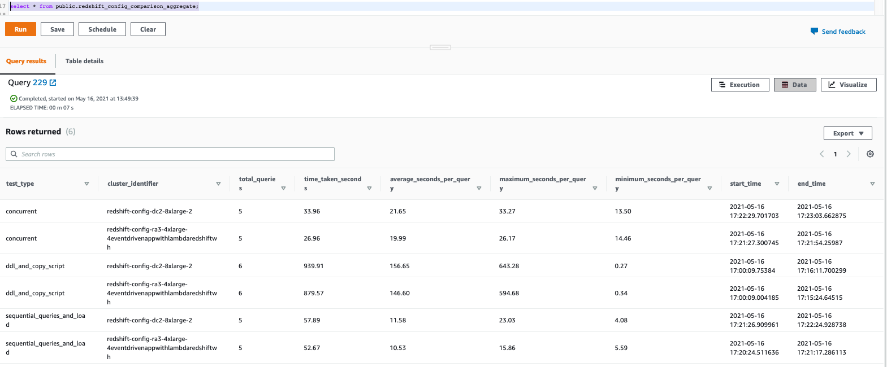
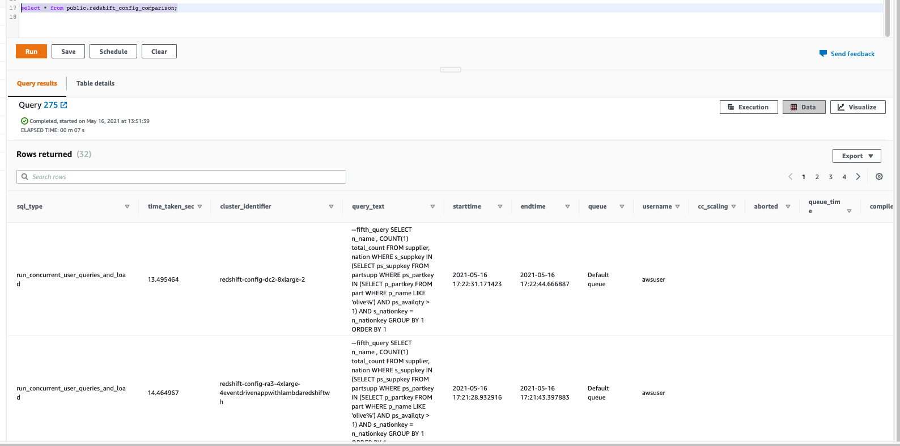

# Automated Evaluation of most optimal Amazon Redshift node configuration

## Introduction
Amazon Redshift is a fast, fully managed, widely popular cloud data warehouse offers different node types to accommodate various workloads, and customers can choose among different node types and node count depending on their
requirements. But sometimes it takes time and efforts from customers to find the most optimal configuration for their workload to meet their price/performance expectations.

In this repository, we are presenting a simple solution leveraging AWS Step Functions and AWS Lambda to run an end-to-end automated test to find the best Redshift configuration based on price/performance expectations. This can be easily deployed using [this CloudFormation template](cf-template.yaml).

## Architecture
The following architecture diagram highlights the end-to-end solution:  
  

As shown in above diagram, we are using AWS Step Functions and AWS Lambda functions to run user provided database scripts in different configurations of their choice. At the end, this process summarizes the metrics from all different configurations to facilitate direct comparison among these configurations.

## Inputs
Below are the inputs for this process:
#### 1. A configuration JSON file indicating different Redshift configurations you would like to test:
The entire process is driven by this configuration JSON file uploaded in S3. It takes the user inputs on what Amazon Redshift configurations you want to test. Here is a [sample](user_config.json)

#### 2. Table Data Definition Language and Copy script to create the tables and data uploaded in an Amazon S3 bucket(optional):
This script is used to create initial tables and load data in them. Please make sure to use *{redshift_iam_role}* whenever you need to refer IAM role of your redshift cluster and it'll be automatically substituted for the actual IAM role of your cluster. Similarly, you may use *{bucket_name}* when you may like to refer an Amazon S3 bucket created by this CloudFormation template. Here is a [sample](test-cases/ddl.sql)

#### 3. SQL script comprising all queries that you would like to test as a single session sequentially (optional):
This script will be run as a single user session in the new redshift clusters. Here is a [sample](test-cases/test_queries.sql)

#### 4. SQL script comprising all queries that you would like to test as concurrent user sessions (optional):
This script will be run with multiple user sessions in the new redshift clusters. It breaks each SQL statement in this script and runs them in parallel using Amazon Redshift Data API. Number of concurrent sessions is therefore same as number of SQL Statements in this script. Here is a [sample](test-cases/test_queries.sql).

#### 5. A configuration JSON file indicating Auto Workload Management parameters, if you use custom Auto WLM: Here is a sample
This is an optional json configuration, you may not need to change in general. But it allows you to have a custom configurations for your Workload Management settings, if you would like to test using that.  Here is a [sample](test-cases/parameter_group_config.json).

## Auto-Steps
Steps to perform the analysis:

1. Upload [DDLs](test-cases/ddl.sql) and [SQL scripts](test-cases/test_queries.sql) mentioned in above section into an Amazon S3 bucket.  

2. Update DDL and SQL Script files' Amazon S3 location in [user_config.json](user_config.json) file and then upload that to same S3 bucket.  

3. Deploy the [CloudFormation template](cf-template.yaml) inputting the s3 location for [user-config.json](user-config.json) file and selecting the VPC and Subnet for the Redshift cluster.  

4. Wait for the [CloudFormation template](cf-template.yaml) to be deployed, which automatically starts an [AWS Step Functions state machine](source-code/RedshiftWhatIfStepFunction.json)  

5. Wait for the [state machine](source-code/RedshiftWhatIfStepFunction.json) to be complete, which takes care of creating the redshift cluster, then running the DDL statements followed by single user queries and then concurrent user queries in those cluster. At the end, it uploads query statistics of each cluster, which you can query by logging on to any of the new Amazon Redshift clusters provisioned by this process.  Below is the state machine diagram ran as part of this process:  

  

6. Run below queries in any of the new Amazon Redshift clusters to verify the test results and compare metrics of different configurations you used in the test.  

```sql
select * from public.redshift_config_comparison_aggregate;
```

  

```sql
select * from public.redshift_config_comparison;
```

  

7. The [CloudFormation template](cf-template.yaml) provisions an Amazon SageMaker notebook along with a notebook to conduct concurrency testing. Please open that notebook and provide the cluster and amazon S3 configuration file location on it. Then it would perform a concurrency testing based on your desired number of threads. Please make sure to set a high number of concurrency scaling setting to perform these concurrency tests on Redshift.

## Security

See [CONTRIBUTING](CONTRIBUTING.md#security-issue-notifications) for more information.

## License

This library is licensed under the MIT-0 License. See the LICENSE file.
