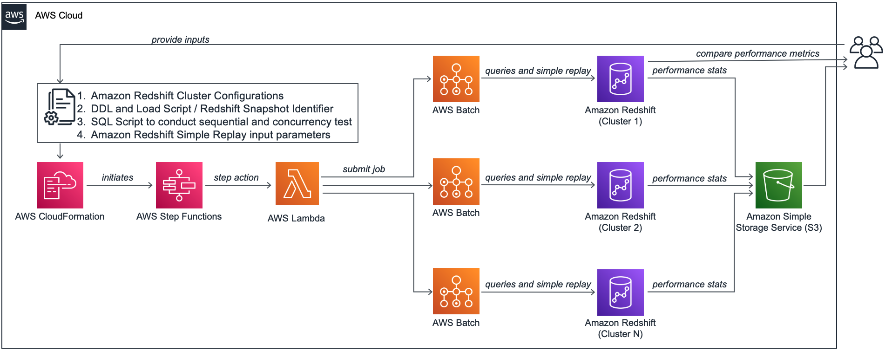

# Amazon Redshift Node Configuration Comparison utility

Amazon Redshift Node Configuration Comparison utility answers a very common question on which instance type and number of nodes should we choose for your workload on Amazon Redshift. You can use this utility to find the right configuration for your cluster based on your query performance expectation for sequential or concurrently running queries. If you are already using Amazon Redshift, you may also run your past workloads using [Amazon Redshift Simple Replay utility](https://github.com/awslabs/amazon-redshift-utils/tree/master/src/SimpleReplay) to evaluate performance metrics for different Amazon Redshift configurations to meet your needs. It helps you find the best configuration for your Amazon Redshift cluster based on price performance expectation.

## Solution Overview

The solution uses [AWS Step Functions](https://aws.amazon.com/step-functions/), [AWS Lambda](https://aws.amazon.com/lambda/) and [AWS Batch](https://aws.amazon.com/batch/) to run an end-to-end automated orchestration to find the best [Amazon Redshift](https://aws.amazon.com/redshift/) configuration based on your price/performance requirements. [AWS CloudFormation template](https://aws.amazon.com/cloudformation/) is used to deploy and run this solution in your AWS Account. Along with other resources, this template also creates an [Amazon S3](https://aws.amazon.com/s3/) bucket to store all data and metadata related to this process.

  

You need to create a JSON file to provide your input configurations for your test:

1. Amazon Redshift Cluster Configurations
2. DDL and Load Script (Optional)
3. Redshift Snapshot Identifier (Optional)
4. SQL Script to conduct sequential and concurrency test (Optional)
5. Amazon Redshift Audit Log location and simple replay time window (Optional)

You need to store this file in an existing Amazon S3 bucket and then use [this AWS CloudFormation template](https://console.aws.amazon.com/cloudformation/home?#/stacks/new?stackName=redshift-node-config-comparison&templateURL=https://s3-us-west-2.amazonaws.com/redshift-simple-replay-ra3/cfn/redshift-node-config-comparison.yaml) to deploy this solution, which will also initiate an iteration of this test by invoking an Amazon Step Functions state machine in your AWS account.

## Prerequisites

This solution uses [AWS CloudFormation](https://aws.amazon.com/cloudformation/) to automatically provision all the required resources in your AWS accounts. It uses AWS Lake Formation to manage access on the AWS Glue catalog which stores the performance comparison stats. If you haven't used AWS Lakeformation before , you need to add yourself as Data Lake Administrator, please follow the instructions here on [Setting up AWS Lake Formation](https://docs.aws.amazon.com/lake-formation/latest/dg/getting-started-setup.html#create-data-lake-admin). For more information, see [Getting started with AWS CloudFormation](https://docs.aws.amazon.com/AWSCloudFormation/latest/UserGuide/GettingStarted.html).

If you are already running Amazon Redshift workload in production, you may like to use this solution to replay your past workload leveraging [Amazon Redshift Simple Replay Utility](https://github.com/awslabs/amazon-redshift-utils/tree/master/src/SimpleReplay). As a prerequisite to use simple replay utility, you need to enable [audit logging](https://docs.aws.amazon.com/redshift/latest/mgmt/db-auditing.html#db-auditing-enable-logging) and [user-activity logging](https://docs.aws.amazon.com/redshift/latest/mgmt/db-auditing.html#db-auditing-user-activity-log) in your Amazon Redshift cluster.

## Example Use Case

As an example, you may assume you have an existing Amazon Redshift cluster with 2 nodes of DC2.8XLarge instances. You would like to evaluate moving this cluster to RA3.4XLarge instances with two and four nodes. For that, you would like to run five test queries sequentially as well as in five parallel sessions in all these clusters. You would also like to replay one hour past workload in these clusters and compare their performance.

For your RA3.4XLarge four node configuration, you would also like to test your workload performance with [concurrency scaling](https://docs.aws.amazon.com/redshift/latest/dg/concurrency-scaling.html) enabled in that cluster, which could help improve concurrent workloads with consistently fast query performance.

At the end of this test, you would like to compare various metrics like total, average, median and maximum time taken for these four cluster configurations:

| **node type** | **number of nodes** | **option** |
| --- | --- | --- |
| dc2.8xlarge | 2 | concurrency scaling disabled |
| ra3.4xlarge | 2 | concurrency scaling disabled |
| ra3.4xlarge | 4 | concurrency scaling disabled |
| ra3.4xlarge | 4 | concurrency scaling enabled |

To perform this test using [Amazon Redshift node configuration comparison utility](https://github.com/aws-samples/amazon-redshift-config-compare), you would like to provide these configurations in a [JSON file](https://github.com/aws-samples/amazon-redshift-config-compare/blob/main/user_config.json) and store it in an Amazon S3 bucket. You may then use [AWS CloudFormation Template](https://console.aws.amazon.com/cloudformation/home?#/stacks/new?stackName=redshift-node-config-comparison&templateURL=https://s3-us-west-2.amazonaws.com/redshift-simple-replay-ra3/cfn/redshift-node-config-comparison.yaml) to deploy this utility, which would perform the end-to-end performance testing in all above clusters in parallel and produce a price/performance evaluation summary. Based on that summary, you would be easily deciding which configuration works best for you.

## Input JSON File

You need to provide a configuration JSON file to use this solution. Below are the input parameters for this JSON file.

| **JSON Parameter** | **Valid Values** | **Description** |
| --- | --- | --- |
| SNAPSHOT\_ID | N/A, Redshift Snapshot Identifier | Input Snapshot Identifier, if you would like to create new redshift clusters by restoring from a snapshot. If you are using this solution in a different AWS account, please make sure to share yur Amazon Redshift cluster snapshot with this account. Please read the [documentation](https://aws.amazon.com/premiumsupport/knowledge-center/account-transfer-redshift/) for more. Input N/A if not applicable |
| SNAPSHOT\_ACCOUNT\_ID | N/A,AWS Account ID | AWS Account ID where above snapshot was created. Input N/A if not applicable |
| PARAMETER\_GROUP\_CONFIG\_S3\_PATH | N/A,Amazon S3 URI | If you may use a custom parameter group for this testing, please input its S3 URI. You may get this JSON by running this command in AWS Command Line interface: "aws redshift describe-cluster-parameters --parameter-group-name your-custom-param-group --output json" Input N/A if not applicable |
| DDL\_AND\_COPY\_SCRIPT\_S3\_PATH | N/A,Amazon S3 URI | If you may create tables and load data on them before performing the testing, please input its S3 URI. InputN/A if not applicable |
| SQL\_SCRIPT\_S3\_PATH | N/A,Amazon S3 URI | If you may run performance testing of your queries, input S3 URI of your script consisting of all your SQL commands. These commands should be deliminated by semicolon (;). InputN/A if not applicable |
| NUMBER\_OF\_PARALLEL\_SESSIONS\_LIST | N/A,Amazon S3 URI | Input comma separated numbers to denote number of parallel sessions in which you would like to run above script |
| SIMPLE\_REPLAY\_LOG\_LOCATION | N/A,Amazon S3 URI | If you are already running Amazon Redshift workload and your cluster has audit logging enabled. Please input the S3 URI of your Redshift Audit Logging location. If you are using this solution in a different AWS account, please make sure to copy these logs from your source clusters' audit logging bucket to an Amazon S3 bucket in this account. |
| SIMPLE\_REPLAY\_EXTRACT\_START\_TIME | N/A,Amazon S3 URI | If using simple-replay in this testing to replay your past workload, input the start time of that workload in ISO-8601 format (e.g. 2021-01-26T21:41:16+00:00) |
| SIMPLE\_REPLAY\_EXTRACT\_END\_TIME | N/A, Amazon S3 URI | If using simple-replay in this testing to replay your past workload, input the end time of that workload in ISO-8601 format (e.g. 2021-01-26T21:41:16+00:00) |
| SIMPLE\_REPLAY\_EXTRACT\_OVERWRITE\_S3\_PATH | N/A,Amazon S3 URI | If using simple-replay and you may like to use a custom extract.yaml file, please input its S3 URI |
| SIMPLE\_REPLAY\_OVERWRITE\_S3\_PATH | N/A,Amazon S3 URI | If using simple-replay and you may like to use a custom replay.yaml file, please input its S3 URI |
| AUTO\_PAUSE | true,false | Input true if you may like to automatically pause all except first Amazon Redshift clusters created for this testing |
| DATABASE\_NAME | N/A,Redshift database name | Specify the primary database name of your Redshift cluster. If you’re using Simple Replay, provide the database name for which you want to replay the workload. Amazon Redshift automatically creates a default database named dev, which may not be your primary database|
| CONFIGURATIONS | JSON Array with parameters NODE\_TYPE, NUMBER\_OF\_NODES, WLM\_CONFIG\_S3\_PATH | Input a JSON Array mentioning your Amazon Redshift cluster configurations, for which you may like to perform this testing. Below are the parameters for this: |
|  |  |  |
| NODE\_TYPE | ra3.xlplus, ra3.4xlarge, ra3.16xlarge, dc2.large, dc2.8xlarge, ds2.xlarge, ds2.8xlarge | Input Amazon Redshift Cluster Node Type for which, you would like to run this testing. |
| NUMBER\_OF\_NODES | a number between 1 and 128 | Input number of nodes for your Amazon Redshift Cluster |
| WLM\_CONFIG\_S3\_PATH | N/A,Amazon S3 URI | If you may like to use custom workload management settings if different Amazon Redshift clusters, please provide the S3 URI for that. |

Here is a sample configuration JSON file, used to implement this example use-case:   

```json
{
  "SNAPSHOT_ID": "redshift-cluster-manual-snapshot",
  "SNAPSHOT_ACCOUNT_ID": "123456789012",

  "PARAMETER_GROUP_CONFIG_S3_PATH": "s3://node-config-compare-bucket/pg_config.json",

  "DDL_AND_COPY_SCRIPT_S3_PATH": "s3://node-config-compare-bucket/ddl.sql",
  "SQL_SCRIPT_S3_PATH":"s3://node-config-compare-bucket/test_queries.sql",
  "NUMBER_OF_PARALLEL_SESSIONS_LIST": "1,5,10",

  "SIMPLE_REPLAY_LOG_LOCATION":"s3://redshift-logging-xxxxxxxx/RSLogs/",
  "SIMPLE_REPLAY_EXTRACT_START_TIME":"2021-08-28T11:15:00+00:00",
  "SIMPLE_REPLAY_EXTRACT_END_TIME":"2021-08-28T12:00:00+00:00",

  "SIMPLE_REPLAY_EXTRACT_OVERWRITE_S3_PATH":"N/A",
  "SIMPLE_REPLAY_OVERWRITE_S3_PATH":"N/A",

  "AUTO_PAUSE": true,
  "DATABASE_NAME": "database_name",

  "CONFIGURATIONS": [
  	{
  	"NODE_TYPE": "dc2.8xlarge",
  	"NUMBER_OF_NODES": "2",
  	"WLM_CONFIG_S3_PATH": "s3://node-config-compare-bucket/source-wlm.json"
  	},
  	{
  	"NODE_TYPE": "ra3.4xlarge",
  	"NUMBER_OF_NODES": "2",
  	"WLM_CONFIG_S3_PATH": "s3://node-config-compare-bucket/source-wlm.json"
  	},
  	{
  	"NODE_TYPE": "ra3.4xlarge",
  	"NUMBER_OF_NODES": "4",
  	"WLM_CONFIG_S3_PATH": "s3://node-config-compare-bucket/source-wlm.json"
  	},
  	{
  	"NODE_TYPE": "ra3.4xlarge",
  	"NUMBER_OF_NODES": "4",
  	"WLM_CONFIG_S3_PATH": "s3://node-config-compare-bucket/wlm-concurrency-scaling.json"
  	}
  ]
  }
```

**Please Note:** Make sure to use same Amazon S3 bucket to store all your configurations for this testing. For example, we used Amazon S3 bucket node-config-compare-bucket to store all configuration scripts. After populating all parameters in this JSON file, please save this JSON file in the same Amazon S3 bucket in your AWS Account.

## Deployment using AWS CloudFormation

Once the configuration JSON file is saved in an Amazon S3 bucket, you may use [this AWS CloudFormation template](https://console.aws.amazon.com/cloudformation/home?#/stacks/new?stackName=redshift-node-config-comparison&templateURL=https://s3-us-west-2.amazonaws.com/redshift-simple-replay-ra3/cfn/redshift-node-config-comparison.yaml) to deploy this solution, which will also initiate an iteration of this test. This template provisions the required AWS Resources except the Amazon Redshift clusters, which gets created in the subsequent step by an AWS Step Functions state machine. This template requires you to provide the following parameters:

| **CloudFormation Parameter** | **Valid Values** | **Description** |
| --- | --- | --- |
| ConfigJsonS3Path | Amazon S3 URI | Input S3 URI where you stored your JSON Configuration File from the previous step. The template would grant access on this Amazon S3 bucket to appropriate AWS resources created by this solution. |
| ClusterIdentifierPrefix | Prefix of Amazon Redshift cluster identifiers | Input a valid string like rs, to be used as prefix of your Amazon Redshift cluster identifiers, created by this solution |
| PreExistingS3BucketToGrantRedshiftAccess | N/A,Amazon S3 URI | If using Redshift Simple Replay, please input Redshift Audit Logging Bucket Name here so that it can grant appropriate permissions to the AWS Resources. You may also add an existing Amazon S3 bucket in same AWS Region, which can be accessed by Redshift. Input N/A if not applicable |
| SourceRedshiftClusterKMSKeyARN | N/A,Amazon S3 URI |  [AWS Key Management Service (KMS) ](https://aws.amazon.com/kms/)Key ARN (Amazon Resource Name) if your source Redshift cluster is encrypted (available on the stack Outputs tab). You need to run extract and replay in the same account, if your source cluster is encrypted.
 |
| OnPremisesCIDR | CIDR Notation |  The IP range (CIDR notation) for your existing infrastructure to access the target and replica clusters from a SQL client. If unsure, enter your corporate desktop's CIDR address. For instance, if your desktop's IP address is 10.156.87.45, enter10.156.87.45/32.
 |
| VPC | N/A,Amazon S3 URI | An existing [Amazon Virtual Private Cloud](https://aws.amazon.com/vpc/) (Amazon VPC) where you want to deploy the clusters and EC2 instances. |
| SubnetId | N/A,Amazon S3 URI | If using simple-replay in this testing to replay your past workload, input the start time of that workload in ISO-8601 format (e.g. 2021-01-26T21:41:16+00:00) |
| UseAWSLakeFormationForGlueCatalog | No,Yes | Default value is No ,Select Yes if AWS Lake Formation is enabled for the account and manages access for Glue catalog|


## Orchestration with AWS Step Functions State Machine

This solution uses AWS Step Functions state machine to orchestrate the end-to-end workflow. The state machine performs the following steps to evaluate price performance of your Amazon Redshift workload:

1. First, it reads the configuration JSON file you provided and creates parallel steps work on different Amazon Redshift cluster configurations in parallel.
2. For each of these steps, it starts by creating new Amazon Redshift clusters based on the configurations you provided in the input JSON file.
3. If you have provided a valid SQL\_SCRIPT\_S3\_PATH parameter value in the input JSON file, it runs performance testing on each of these new Amazon Redshift clusters in parallel. It runs these iterations concurrently based on the input parameter NUMBER\_OF\_PARALLEL\_SESSIONS\_LIST
4. If you have provided a valid SIMPLE\_REPLAY\_LOG\_LOCATION parameter value in the input JSON file, it runs extract and replay steps of [Amazon Redshift Simple Replay Utility](https://github.com/awslabs/amazon-redshift-utils/tree/master/src/SimpleReplay) to replay your past workloads in these clusters. It replays your past workloads starting SIMPLE\_REPLAY\_EXTRACT\_START\_TIME till SIMPLE\_REPLAY\_EXTRACT\_END\_TIME as mentioned in the input JSON file.
5. Then it [unloads](https://docs.aws.amazon.com/redshift/latest/dg/r_UNLOAD.html) statistics of this testing from each of these clusters to an Amazon S3 bucket, which got created by the CloudFormation template stack in previous step.
6. If you have provided the value true for parameter AUTO\_PAUSE in the input JSON file, it will pause the Amazon Redshift clusters except the first cluster
7. When above steps are completed for all new Amazon Redshift clusters that were created as part of this process, it runs an [AWS Glue Crawler](https://docs.aws.amazon.com/glue/latest/dg/add-crawler.html) to create tables in [AWS Glue Data Catalog](https://docs.aws.amazon.com/glue/latest/dg/populate-data-catalog.html) to facilitate comparing performance of these Amazon Redshift clusters from the unloaded statistics.
8. At the last step, it unloads the comparison results to the Amazon S3 bucket for your future reference.

This state machine is run automatically when the CloudFormation stack is deployed in your account. Subsequently, you may re-upload your input parameter JSON file to try changing different parameter values and then rerun this state machine from the [AWS Console](https://console.aws.amazon.com/states/home). Following diagram shows this AWS Step Functions State Machine workflow:

  


For the example use-case, below Amazon Redshift clusters got created as part of this state machine run, which automatically paused all clusters except the first one:

  

## Performance Evaluation

This solution creates an external schema redshift\_config\_comparison and creates three external tables comparison\_stats, cluster\_config and pricingin that schema to read the raw data created by this solution in an Amazon S3 bucket. Based on these external tables, it creates the views redshift\_config\_comparison\_results, redshift\_config\_comparison\_raw and redshift\_config\_comparison\_pricing in public schema of your Amazon Redshift clusters to compare their price-performance metrics.

**REDSHIFT\_CONFIG\_COMPARISON\_RESULTS:**

This view provides the aggregated comparison summary of your Amazon Redshift clusters. Test Type column in this view indicates if the test type was to replay your past workload using simple replay utility or a concurrency test to run your queries in parallel with different concurrency numbers.

It provides the raw value and a percentage number for metrices like total, mean, median, max query times, percentile-75, percentile-90 and percentile-90 to show how your Amazon Redshift clusters are performing as compared to the worst performing cluster for all these test types. For example, below was the outcome of your example use-case:

```sql
select * from public.redshift_config_comparison_results;
```

| **test type** | **cluster identifier** | **total query time seconds** | **improved total query time** | **mean query time seconds** | **improved mean query time** | **median query time seconds** | **improved median query time** |
| --- | --- | --- | --- | --- | --- | --- | --- |
| simple-replay | rs-dc2-8xlarge-2 | 20.1 | 75% | 1 | 76% | 0.801 | 46% |
| simple-replay | rs-ra3-4xlarge-2 | 35.26 | 0% | 1.76 | 0% | 1.063 | 10% |
| simple-replay | rs-ra3-4xlarge-4 | 19.58 | 80% | 0.98 | 80% | 0.681 | 72% |
| simple-replay | rs-ra3-4xlarge-4-cs | 20.16 | 75% | 1.01 | 74% | 0.716 | 63% |
| concurrency-1 | rs-dc2-8xlarge-2 | 3.46 | 4% | 0.69 | 4% | 0.576 | 0% |
| concurrency-1 | rs-ra3-4xlarge-2 | 3.61 | 0% | 0.72 | 0% | 0.571 | 1% |
| concurrency-1 | rs-ra3-4xlarge-4 | 2.67 | 35% | 0.53 | 36% | 0.445 | 29% |
| concurrency-1 | rs-ra3-4xlarge-4-cs | 1.45 | 149% | 0.29 | 148% | 0.275 | 109% |
| concurrency-5 | rs-dc2-8xlarge-2 | 22.74 | 102% | 0.91 | 102% | 0.615 | 135% |
| concurrency-5 | rs-ra3-4xlarge-2 | 45.88 | 0% | 1.84 | 0% | 1.443 | 0% |
| concurrency-5 | rs-ra3-4xlarge-4 | 22.75 | 102% | 0.91 | 102% | 0.808 | 79% |
| concurrency-5 | rs-ra3-4xlarge-4-cs | 21.19 | 117% | 0.9 | 104% | 0.884 | 63% |
| concurrency-10 | rs-dc2-8xlarge-2 | 127.46 | 39% | 2.55 | 38% | 1.797 | 81% |
| concurrency-10 | rs-ra3-4xlarge-2 | 176.62 | 0% | 3.53 | 0% | 3.256 | 0% |
| concurrency-10 | rs-ra3-4xlarge-4 | 92.18 | 92% | 1.84 | 92% | 1.661 | 96% |
| concurrency-10 | rs-ra3-4xlarge-4-cs | 88.16 | 100% | 1.76 | 101% | 1.59 | 105% |


Based on above results, you may observe that four nodes of RA3.4XLarge with concurrency scaling enabled was the best performing configuration in this testing.

**REDSHIFT\_CONFIG\_COMPARISON\_RAW:**

This view provides the query level comparison summary of your Amazon Redshift clusters.

```sql
select * from public.redshift_config_comparison_raw;
```

| **query hash** | **cluster identifier** | **exec time seconds** | **total query time seconds** | **compile time seconds** | **queue time seconds** | **cc scaling** | **userid** | **query** |
| --- | --- | --- | --- | --- | --- | --- | --- | --- |
| 0531f3b54885afb | rs-dc2-8xlarge-2 | 2 | 7 | 5 | 0 | 0 | 100 | 623 |
| 0531f3b54885afb | rs-ra3-4xlarge-2 | 4 | 5 | 0 | 0 | 0 | 100 | 718 |
| 0531f3b54885afb | rs-ra3-4xlarge-4 | 2 | 5 | 3 | 0 | 0 | 100 | 727 |
| 0531f3b54885afb | rs-ra3-4xlarge-4-cs | 2 | 5 | 3 | 0 | 0 | 100 | 735 |
| 10ef3990f05c9f8 | rs-dc2-8xlarge-2 | 0 | 0 | 0 | 0 | 0 | 100 | 547 |
| 10ef3990f05c9f8 | rs-ra3-4xlarge-2 | 0 | 0 | 0 | 0 | 0 | 100 | 644 |
| 10ef3990f05c9f8 | rs-ra3-4xlarge-4 | 0 | 0 | 0 | 0 | 0 | 100 | 659 |
| 10ef3990f05c9f8 | rs-ra3-4xlarge-4-cs | 0 | 0 | 0 | 0 | 0 | 100 | 661 |
| 27dcd325d97f079 | rs-dc2-8xlarge-2 | 1 | 1 | 0 | 0 | 0 | 100 | 646 |
| 27dcd325d97f079 | rs-ra3-4xlarge-2 | 3 | 4 | 0 | 0 | 0 | 100 | 743 |

**REDSHIFT\_CONFIG\_COMPARISON\_PRICING**

This view provides the public pricing information for your Amazon Redshift cluster configurations based on data available in [AWS Price List API](https://docs.aws.amazon.com/awsaccountbilling/latest/aboutv2/using-ppslong.html) as below:

```sql
select * from public.redshift_config_comparison_pricing;
```
| **node**** type **|** number of nodes **|** pricing ****options** | **your cluster yearly compute cost** | **per compute node yearly cost** |
| --- | --- | --- | --- | --- |
| dc2.8xlarge | 2 | On-Demand | $84,096 | $42,048 |
| dc2.8xlarge | 2 | Reserved-1yr-All Upfront | $55,280 | $27,640 |
| dc2.8xlarge | 2 | Reserved-1yr-No Upfront | $66,576 | $33,288 |
| dc2.8xlarge | 2 | Reserved-3yr-All Upfront | $26,312 | $13,156 |
| ra3.4xlarge | 2 | On-Demand | $57,114 | $28,557 |
| ra3.4xlarge | 2 | Reserved-1yr-All Upfront | $37,696 | $18,848 |
| ra3.4xlarge | 2 | Reserved-1yr-No Upfront | $39,980 | $19,990 |
| ra3.4xlarge | 2 | Reserved-3yr-All Upfront | $21,418 | $10,709 |
| ra3.4xlarge | 2 | Reserved-3yr-No Upfront | $24,844 | $12,422 |
| ra3.4xlarge | 4 | On-Demand | $114,228 | $28,557 |
| ra3.4xlarge | 4 | Reserved-1yr-All Upfront | $75,392 | $18,848 |
| ra3.4xlarge | 4 | Reserved-1yr-No Upfront | $79,960 | $19,990 |
| ra3.4xlarge | 4 | Reserved-3yr-All Upfront | $42,836 | $10,709 |
| ra3.4xlarge | 4 | Reserved-3yr-No Upfront | $49,688 | $12,422 |


## Security

See [CONTRIBUTING](CONTRIBUTING.md#security-issue-notifications) for more information.

## License

This library is licensed under the MIT-0 License. See the LICENSE file.
